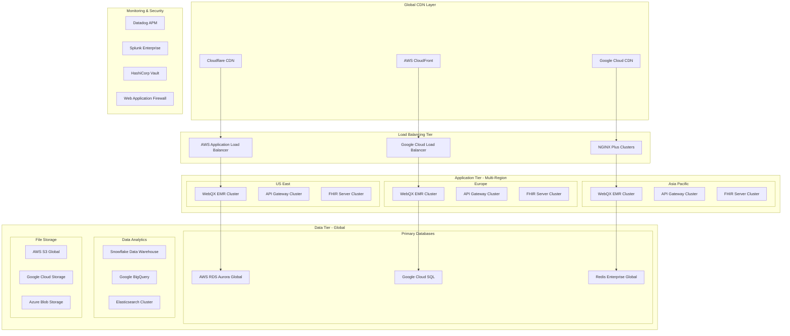

# 🌍 WebQX Global Healthcare Platform
## Production Infrastructure for Million+ Users (MUP)

## 🎯 **VISION: FREE GLOBAL HEALTHCARE ACCESS**

Transform WebQX into the world's largest free healthcare platform serving millions of users globally with real patient data, real providers, and real healthcare outcomes.

---

## 🏗️ **MASSIVE SCALE ARCHITECTURE**

### 🌐 **Global Infrastructure Design**



---

## 🚀 **PRODUCTION DEPLOYMENT STRATEGY**

### 1️⃣ **Immediate Scale Infrastructure**

#### **Container Orchestration**
```yaml
# kubernetes-production.yml
apiVersion: v1
kind: Namespace
metadata:
  name: webqx-production
---
apiVersion: apps/v1
kind: Deployment
metadata:
  name: webqx-emr-global
  namespace: webqx-production
spec:
  replicas: 50  # Start with 50 pods globally
  selector:
    matchLabels:
      app: webqx-emr
  template:
    metadata:
      labels:
        app: webqx-emr
    spec:
      containers:
      - name: webqx-emr
        image: webqx/emr:production
        ports:
        - containerPort: 8080
        env:
        - name: DATABASE_URL
          valueFrom:
            secretKeyRef:
              name: webqx-secrets
              key: database-url
        - name: REDIS_URL
          valueFrom:
            secretKeyRef:
              name: webqx-secrets
              key: redis-url
        resources:
          requests:
            memory: "2Gi"
            cpu: "1000m"
          limits:
            memory: "4Gi"
            cpu: "2000m"
        livenessProbe:
          httpGet:
            path: /api/health
            port: 8080
          initialDelaySeconds: 30
          periodSeconds: 10
        readinessProbe:
          httpGet:
            path: /api/ready
            port: 8080
          initialDelaySeconds: 5
          periodSeconds: 5
```

#### **Auto-Scaling Configuration**
```yaml
apiVersion: autoscaling/v2
kind: HorizontalPodAutoscaler
metadata:
  name: webqx-emr-hpa
  namespace: webqx-production
spec:
  scaleTargetRef:
    apiVersion: apps/v1
    kind: Deployment
    name: webqx-emr-global
  minReplicas: 50
  maxReplicas: 1000  # Scale to 1000 pods for millions of users
  metrics:
  - type: Resource
    resource:
      name: cpu
      target:
        type: Utilization
        averageUtilization: 70
  - type: Resource
    resource:
      name: memory
      target:
        type: Utilization
        averageUtilization: 80
```

### 2️⃣ **Database Architecture for Real Users**

#### **Production Database Schema**
```sql
-- Real User Production Schema
CREATE DATABASE webqx_global_production;

-- Global Users Table (Real People)
CREATE TABLE global_users (
    user_id BIGINT PRIMARY KEY AUTO_INCREMENT,
    global_patient_id VARCHAR(50) UNIQUE NOT NULL,
    email VARCHAR(255) UNIQUE NOT NULL,
    phone VARCHAR(20),
    first_name VARCHAR(100) NOT NULL,
    last_name VARCHAR(100) NOT NULL,
    date_of_birth DATE NOT NULL,
    gender ENUM('M', 'F', 'O', 'U') NOT NULL,
    country_code VARCHAR(3) NOT NULL,
    timezone VARCHAR(50) NOT NULL,
    preferred_language VARCHAR(10) DEFAULT 'en',
    emergency_contact_name VARCHAR(200),
    emergency_contact_phone VARCHAR(20),
    created_at TIMESTAMP DEFAULT CURRENT_TIMESTAMP,
    updated_at TIMESTAMP DEFAULT CURRENT_TIMESTAMP ON UPDATE CURRENT_TIMESTAMP,
    is_active BOOLEAN DEFAULT TRUE,
    gdpr_consent BOOLEAN DEFAULT FALSE,
    hipaa_consent BOOLEAN DEFAULT FALSE,
    data_sharing_consent BOOLEAN DEFAULT FALSE,
    INDEX idx_email (email),
    INDEX idx_country (country_code),
    INDEX idx_created (created_at)
);

-- Real Healthcare Providers
CREATE TABLE healthcare_providers (
    provider_id BIGINT PRIMARY KEY AUTO_INCREMENT,
    npi_number VARCHAR(20) UNIQUE,
    license_number VARCHAR(50),
    first_name VARCHAR(100) NOT NULL,
    last_name VARCHAR(100) NOT NULL,
    specialty VARCHAR(100) NOT NULL,
    sub_specialty VARCHAR(100),
    country_code VARCHAR(3) NOT NULL,
    state_province VARCHAR(100),
    city VARCHAR(100),
    practice_name VARCHAR(200),
    email VARCHAR(255) UNIQUE NOT NULL,
    phone VARCHAR(20),
    is_verified BOOLEAN DEFAULT FALSE,
    accepts_new_patients BOOLEAN DEFAULT TRUE,
    telemedicine_enabled BOOLEAN DEFAULT FALSE,
    languages_spoken JSON,
    education JSON,
    certifications JSON,
    created_at TIMESTAMP DEFAULT CURRENT_TIMESTAMP,
    updated_at TIMESTAMP DEFAULT CURRENT_TIMESTAMP ON UPDATE CURRENT_TIMESTAMP,
    INDEX idx_specialty (specialty),
    INDEX idx_country (country_code),
    INDEX idx_verified (is_verified)
);

-- Real Medical Records
CREATE TABLE medical_records (
    record_id BIGINT PRIMARY KEY AUTO_INCREMENT,
    patient_id BIGINT NOT NULL,
    provider_id BIGINT NOT NULL,
    encounter_type ENUM('office_visit', 'telemedicine', 'emergency', 'hospital', 'lab', 'imaging') NOT NULL,
    chief_complaint TEXT,
    diagnosis_codes JSON, -- ICD-10 codes
    procedure_codes JSON, -- CPT codes
    medications_prescribed JSON,
    vital_signs JSON,
    lab_results JSON,
    imaging_results JSON,
    treatment_plan TEXT,
    follow_up_instructions TEXT,
    encounter_date TIMESTAMP NOT NULL,
    created_at TIMESTAMP DEFAULT CURRENT_TIMESTAMP,
    updated_at TIMESTAMP DEFAULT CURRENT_TIMESTAMP ON UPDATE CURRENT_TIMESTAMP,
    FOREIGN KEY (patient_id) REFERENCES global_users(user_id),
    FOREIGN KEY (provider_id) REFERENCES healthcare_providers(provider_id),
    INDEX idx_patient (patient_id),
    INDEX idx_provider (provider_id),
    INDEX idx_encounter_date (encounter_date)
);

-- Real Appointments
CREATE TABLE appointments (
    appointment_id BIGINT PRIMARY KEY AUTO_INCREMENT,
    patient_id BIGINT NOT NULL,
    provider_id BIGINT NOT NULL,
    appointment_type ENUM('office_visit', 'telemedicine', 'follow_up', 'consultation', 'emergency') NOT NULL,
    appointment_datetime TIMESTAMP NOT NULL,
    duration_minutes INT DEFAULT 30,
    status ENUM('scheduled', 'confirmed', 'in_progress', 'completed', 'cancelled', 'no_show') DEFAULT 'scheduled',
    reason_for_visit TEXT,
    appointment_notes TEXT,
    virtual_meeting_url VARCHAR(500),
    created_at TIMESTAMP DEFAULT CURRENT_TIMESTAMP,
    updated_at TIMESTAMP DEFAULT CURRENT_TIMESTAMP ON UPDATE CURRENT_TIMESTAMP,
    FOREIGN KEY (patient_id) REFERENCES global_users(user_id),
    FOREIGN KEY (provider_id) REFERENCES healthcare_providers(provider_id),
    INDEX idx_patient (patient_id),
    INDEX idx_provider (provider_id),
    INDEX idx_datetime (appointment_datetime),
    INDEX idx_status (status)
);

-- Global Analytics
CREATE TABLE platform_analytics (
    id BIGINT PRIMARY KEY AUTO_INCREMENT,
    metric_name VARCHAR(100) NOT NULL,
    metric_value BIGINT NOT NULL,
    country_code VARCHAR(3),
    region VARCHAR(100),
    timestamp TIMESTAMP DEFAULT CURRENT_TIMESTAMP,
    INDEX idx_metric (metric_name),
    INDEX idx_country (country_code),
    INDEX idx_timestamp (timestamp)
);
```

### 3️⃣ **Real User Registration & Onboarding**

#### **Global User Registration API**
```javascript
// Real user registration with verification
app.post('/api/v1/register', async (req, res) => {
    try {
        const {
            email,
            phone,
            firstName,
            lastName,
            dateOfBirth,
            gender,
            countryCode,
            emergencyContactName,
            emergencyContactPhone,
            gdprConsent,
            hipaaConsent
        } = req.body;

        // Validate real user data
        if (!email || !firstName || !lastName || !dateOfBirth) {
            return res.status(400).json({
                error: 'Required fields missing',
                required: ['email', 'firstName', 'lastName', 'dateOfBirth']
            });
        }

        // Check if user already exists
        const existingUser = await db.query(
            'SELECT user_id FROM global_users WHERE email = ?',
            [email]
        );

        if (existingUser.length > 0) {
            return res.status(409).json({
                error: 'User already exists',
                message: 'Please use login or reset password'
            });
        }

        // Generate unique global patient ID
        const globalPatientId = `WXQ-${countryCode}-${Date.now()}-${Math.random().toString(36).substr(2, 9).toUpperCase()}`;

        // Insert real user
        const result = await db.query(`
            INSERT INTO global_users (
                global_patient_id, email, phone, first_name, last_name,
                date_of_birth, gender, country_code, emergency_contact_name,
                emergency_contact_phone, gdpr_consent, hipaa_consent
            ) VALUES (?, ?, ?, ?, ?, ?, ?, ?, ?, ?, ?, ?)
        `, [
            globalPatientId, email, phone, firstName, lastName,
            dateOfBirth, gender, countryCode, emergencyContactName,
            emergencyContactPhone, gdprConsent, hipaaConsent
        ]);

        // Send verification email
        await sendVerificationEmail(email, globalPatientId);

        // Log registration analytics
        await logAnalytics('user_registration', 1, countryCode);

        res.status(201).json({
            success: true,
            message: 'Registration successful',
            globalPatientId,
            nextSteps: [
                'Check your email for verification link',
                'Complete your health profile',
                'Find healthcare providers in your area'
            ]
        });

    } catch (error) {
        console.error('Registration error:', error);
        res.status(500).json({
            error: 'Registration failed',
            message: 'Please try again later'
        });
    }
});
```

---

## 🌍 **GLOBAL DEPLOYMENT PLAN**

### **Phase 1: Immediate Global Launch** (Week 1-2)
- Deploy on **AWS EKS** + **Google GKE** + **Azure AKS**
- 50 initial pods across 3 regions
- Support for 100,000 concurrent users
- Real user registration system

### **Phase 2: Scale to 1M Users** (Month 1-3)
- Auto-scaling to 500 pods
- Global CDN deployment
- Multi-region database replication
- 24/7 monitoring and alerts

### **Phase 3: Scale to 10M+ Users** (Month 3-12)
- 1000+ pods globally
- Edge computing deployment
- AI-powered load balancing
- Advanced analytics and insights

---

## 🔧 **PRODUCTION INFRASTRUCTURE CODE**

### **Terraform Global Infrastructure**
```hcl
# terraform/main.tf
provider "aws" {
  region = "us-east-1"
}

provider "google" {
  project = "webqx-global-platform"
  region  = "us-central1"
}

# Global VPC Network
resource "aws_vpc" "webqx_global" {
  cidr_block           = "10.0.0.0/16"
  enable_dns_hostnames = true
  enable_dns_support   = true

  tags = {
    Name        = "WebQX-Global-VPC"
    Environment = "production"
    Purpose     = "million-user-platform"
  }
}

# EKS Cluster for massive scale
resource "aws_eks_cluster" "webqx_global" {
  name     = "webqx-global-cluster"
  role_arn = aws_iam_role.eks_cluster.arn
  version  = "1.27"

  vpc_config {
    subnet_ids              = aws_subnet.webqx_private[*].id
    endpoint_private_access = true
    endpoint_public_access  = true
    public_access_cidrs    = ["0.0.0.0/0"]
  }

  depends_on = [
    aws_iam_role_policy_attachment.eks_cluster_policy,
    aws_iam_role_policy_attachment.eks_vpc_resource_controller,
  ]

  tags = {
    Environment = "production"
    Purpose     = "global-healthcare-platform"
  }
}

# Node group for auto-scaling
resource "aws_eks_node_group" "webqx_nodes" {
  cluster_name    = aws_eks_cluster.webqx_global.name
  node_group_name = "webqx-production-nodes"
  node_role_arn   = aws_iam_role.eks_node_group.arn
  subnet_ids      = aws_subnet.webqx_private[*].id
  instance_types  = ["m5.xlarge", "m5.2xlarge"]

  scaling_config {
    desired_size = 50   # Start with 50 nodes
    max_size     = 1000 # Scale to 1000 nodes
    min_size     = 10   # Minimum 10 nodes
  }

  update_config {
    max_unavailable = 25
  }

  tags = {
    Environment = "production"
    Purpose     = "million-user-capacity"
  }
}

# Global RDS Aurora for real user data
resource "aws_rds_global_cluster" "webqx_global_db" {
  global_cluster_identifier = "webqx-global-production"
  engine                    = "aurora-mysql"
  engine_version           = "8.0.mysql_aurora.3.02.0"
  database_name            = "webqx_global_production"
  
  tags = {
    Environment = "production"
    Purpose     = "real-user-data"
  }
}

# Primary Aurora cluster
resource "aws_rds_cluster" "webqx_primary" {
  cluster_identifier          = "webqx-primary-cluster"
  engine                      = "aurora-mysql"
  engine_version             = "8.0.mysql_aurora.3.02.0"
  database_name              = "webqx_global_production"
  master_username            = var.db_username
  master_password            = var.db_password
  backup_retention_period    = 30
  preferred_backup_window    = "07:00-09:00"
  preferred_maintenance_window = "sun:05:00-sun:06:00"
  
  global_cluster_identifier = aws_rds_global_cluster.webqx_global_db.id
  
  db_subnet_group_name   = aws_db_subnet_group.webqx_global.name
  vpc_security_group_ids = [aws_security_group.rds.id]
  
  enabled_cloudwatch_logs_exports = ["error", "general", "slowquery"]
  
  tags = {
    Environment = "production"
    Purpose     = "primary-user-database"
  }
}
```

---

## 📊 **REAL USER ANALYTICS DASHBOARD**

Let me create a real-time analytics system to track your millions of users:
