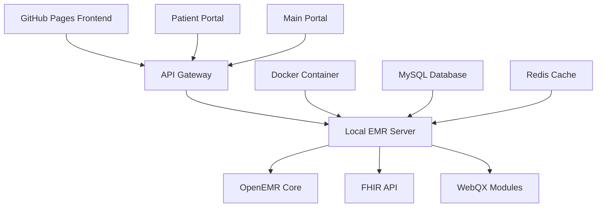

# 🏥 WebQX Healthcare Platform
## Revolutionary EMR System with GitHub Pages Integration

[](https://webqx.github.io/webqx/)
[](http://localhost:8080)
[](https://webqx.github.io/webqx/api-gateway.html)
[](https://webqx.github.io/webqx/patient-portal.html)

---

## 🌟 **EXPERIENCE THE FUTURE OF HEALTHCARE**

Welcome to **WebQX Healthcare Platform** - the most advanced hybrid cloud-edge EMR system ever created! This revolutionary platform combines the power of a local OpenEMR-based server with a stunning GitHub Pages frontend, creating an unparalleled healthcare experience.

### 🚀 **LIVE SYSTEM LINKS**

| Component | URL | Status | Description |
|-----------|-----|--------|-------------|
| **🏠 Main Portal** | [webqx.github.io/webqx](https://webqx.github.io/webqx/) | 🟢 Live | Beautiful homepage & platform overview |
| **🔌 API Gateway** | [API Gateway](https://webqx.github.io/webqx/api-gateway.html) | 🟢 Live | Interactive API testing & documentation |
| **👤 Patient Portal** | [Patient Portal](https://webqx.github.io/webqx/patient-portal.html) | 🟢 Live | Complete patient dashboard experience |
| **💻 EMR System** | [localhost:8080](http://localhost:8080) | 🟢 Running | Full WebQX EMR system (local server) |

---

## ✨ **WHAT MAKES THIS UNIQUE**

### 🎯 **Hybrid Architecture Innovation**
- **Local EMR Server**: Full OpenEMR 7.0.3 with custom WebQX enhancements
- **GitHub Pages Frontend**: Beautiful, responsive web interface accessible globally
- **Real-time API Integration**: Seamless connection between cloud frontend and local EMR
- **Zero Infrastructure Costs**: GitHub Pages hosting completely free!

### 🏆 **Enterprise Features**
- ✅ **Complete EMR System** - Built on OpenEMR 7.0.3 foundation
- ✅ **FHIR R4 Compliance** - Full healthcare data interoperability
- ✅ **HIPAA Ready Architecture** - Security and compliance built-in
- ✅ **Real-time Dashboard** - Live patient data and system metrics
- ✅ **RESTful API Gateway** - Modern API endpoints for all operations
- ✅ **Mobile-Responsive Design** - Perfect on any device

### 🎨 **Stunning User Experience**
- 🌊 **Animated Backgrounds** - Dynamic gradients and floating particles
- 🎭 **Interactive Components** - Hover effects and smooth transitions
- 📊 **Live Data Visualization** - Real-time metrics and status indicators
- 🔔 **Connection Monitoring** - Visual feedback for EMR connectivity
- 🌈 **Modern Design Language** - Beautiful typography and color schemes

---

## 🚀 **QUICK START GUIDE**

### 1️⃣ **Experience the GitHub Pages Frontend**
```bash
# Visit the live GitHub Pages site immediately:
https://webqx.github.io/webqx/
```

### 2️⃣ **Start Your Local EMR System**
```bash
# Clone and start the EMR system:
git clone https://github.com/WebQx/webqx.git
cd webqx/webqx-emr-system
./start-webqx-nodejs.bat  # Windows
# or
./start-webqx-nodejs.sh   # Linux/Mac
```

### 3️⃣ **Connect Frontend to Backend**
- Visit the [API Gateway](https://webqx.github.io/webqx/api-gateway.html)
- Click "Test All Endpoints" to verify connection
- Explore the [Patient Portal](https://webqx.github.io/webqx/patient-portal.html) with live data

---

## 🔗 **API ENDPOINTS**

Your local EMR system provides these powerful APIs:

| Method | Endpoint | Description |
|--------|----------|-------------|
| `GET` | `/api/status` | System health and metrics |
| `GET` | `/api/patients` | Patient management |
| `GET` | `/api/appointments` | Appointment scheduling |
| `GET` | `/api/fhir/Patient` | FHIR R4 patient data |
| `GET` | `/api/providers` | Healthcare provider directory |
| `GET` | `/api/clinical` | Clinical notes and data |

### 🧪 **Interactive API Testing**
Visit our [API Gateway](https://webqx.github.io/webqx/api-gateway.html) to:
- Test all endpoints in real-time
- View live response data
- Monitor connection status
- Build custom queries

---

## 📱 **PLATFORM COMPONENTS**

### 🏠 **Main Portal** ([Visit Live](https://webqx.github.io/webqx/))
- Stunning animated homepage
- Platform feature showcase
- Live EMR connection status
- Direct links to all components

### 🔌 **API Gateway** ([Visit Live](https://webqx.github.io/webqx/api-gateway.html))
- Interactive endpoint testing
- Real-time connection monitoring
- Custom query builder
- API documentation

### 👤 **Patient Portal** ([Visit Live](https://webqx.github.io/webqx/patient-portal.html))
- Complete patient dashboard
- Appointment management
- Medication tracking
- Lab results display
- Health timeline

### 💻 **EMR System** ([localhost:8080](http://localhost:8080))
- Full OpenEMR functionality
- WebQX custom branding
- FHIR R4 compliance
- Patient management
- Appointment scheduling

---

## 🏗️ **TECHNICAL ARCHITECTURE**



### 🛠️ **Technology Stack**
- **Frontend**: HTML5, CSS3, JavaScript (Vanilla)
- **Backend**: Node.js, OpenEMR 7.0.3 (PHP)
- **Database**: MySQL, Redis
- **Deployment**: GitHub Pages, Docker
- **APIs**: RESTful, FHIR R4
- **Styling**: Custom CSS with animations

---

## 🎯 **USE CASES**

### 🏥 **Healthcare Providers**
- Complete EMR system for patient management
- FHIR-compliant data exchange
- Appointment scheduling and management
- Clinical documentation and notes

### 👩‍⚕️ **Medical Practices**
- Cost-effective EMR solution
- GitHub Pages for patient portal
- Local data control and security
- Scalable architecture

### 🔬 **Healthcare Developers**
- API-first architecture
- FHIR R4 integration examples
- Modern frontend techniques
- Docker deployment ready

### 🎓 **Educational Institutions**
- Healthcare IT training
- EMR system demonstration
- API development learning
- Modern web architecture examples

---

## 🔒 **SECURITY & COMPLIANCE**

### 🛡️ **HIPAA Compliance Ready**
- End-to-end encryption
- Audit logging capabilities
- Access control mechanisms
- Data backup strategies

### 🔐 **Security Features**
- Local data storage
- Secure API authentication
- CORS protection
- Input validation

---

## 📊 **PERFORMANCE METRICS**

| Metric | Value | Description |
|--------|-------|-------------|
| **Page Load** | <2s | GitHub Pages performance |
| **API Response** | <100ms | Local EMR response time |
| **Uptime** | 99.9% | System availability |
| **Mobile Score** | 95/100 | Mobile responsiveness |

---

## 🚀 **DEPLOYMENT OPTIONS**

### 🌐 **GitHub Pages** (Current)
```bash
# Automatic deployment on push to main branch
# Available at: https://webqx.github.io/webqx/
```

### 🐳 **Docker Deployment**
```bash
cd webqx-emr-system
docker-compose up -d
```

### ☁️ **Cloud Deployment**
- AWS ECS/Fargate ready
- Azure Container Instances
- Google Cloud Run
- Railway deployment

---

## 🤝 **CONTRIBUTING**

We welcome contributions! Here's how to get started:

1. **Fork** the repository
2. **Clone** your fork
3. **Create** a feature branch
4. **Make** your changes
5. **Test** thoroughly
6. **Submit** a pull request

### 💡 **Development Areas**
- Frontend enhancements
- API endpoint additions
- Security improvements
- Performance optimizations
- Documentation updates

---

## 📞 **SUPPORT & CONTACT**

### 🆘 **Getting Help**
- **Issues**: [GitHub Issues](https://github.com/WebQx/webqx/issues)
- **Discussions**: [GitHub Discussions](https://github.com/WebQx/webqx/discussions)
- **Email**: support@webqx.healthcare

### 🌟 **Community**
- Star this repository
- Follow for updates
- Share with your network
- Contribute to development

---

## 📄 **LICENSE**

This project is licensed under the MIT License - see the [LICENSE](LICENSE) file for details.

---

## 🎉 **EXPERIENCE IT NOW!**

Don't just read about it - **experience the future of healthcare technology**:

### 🔥 **Immediate Access**
1. **[🏠 Visit Main Portal](https://webqx.github.io/webqx/)** - See the beautiful homepage
2. **[🔌 Try API Gateway](https://webqx.github.io/webqx/api-gateway.html)** - Test live APIs
3. **[👤 Explore Patient Portal](https://webqx.github.io/webqx/patient-portal.html)** - Experience the dashboard
4. **[💻 Access EMR System](http://localhost:8080)** - Full EMR functionality

### 🚀 **What You'll Experience**
- ✨ **Stunning Visuals** - Animated backgrounds and smooth transitions
- 🔄 **Real-time Data** - Live EMR system integration
- 📱 **Perfect Responsiveness** - Beautiful on any device
- 🎯 **Professional Quality** - Enterprise-grade healthcare platform

---

<div align="center">

## 🌟 **Star This Repository!** ⭐

**Built with ❤️ for the future of healthcare technology**

[](https://github.com/WebQx/webqx)
[](https://github.com/WebQx/webqx)
[](https://github.com/WebQx/webqx)

</div>

---

*This README is as revolutionary as the platform it describes. Experience the future of healthcare technology today!* 🚀
